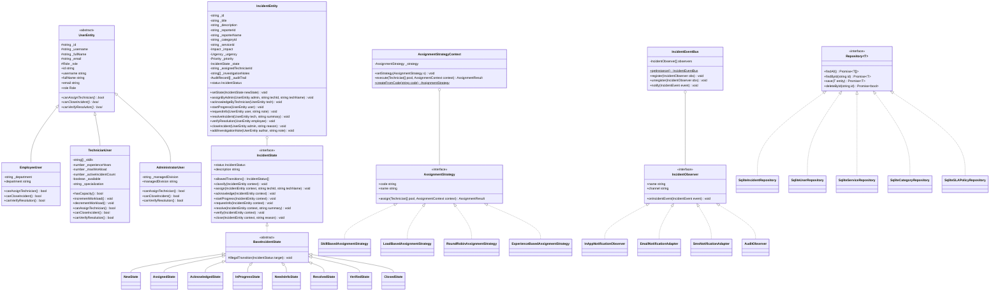

# I-ITSM Domain Class Diagram

```mermaid
classDiagram
    %% User Entity Hierarchy
    class UserEntity {
        <<abstract>>
        #string _id
        #string _username
        #string _fullName
        #string _email
        #Role _role
        +id string
        +username string
        +fullName string
        +email string
        +role Role
        +canAssignTechnician()* bool
        +canCloseIncident()* bool
        +canVerifyResolution()* bool
    }

    class EmployeeUser {
        -string _department
        +department string
        +canAssignTechnician() bool
        +canCloseIncident() bool
        +canVerifyResolution() bool
    }

    class TechnicianUser {
        -string[] _skills
        -number _experienceYears
        -number _maxWorkload
        -number _activeIncidentCount
        -boolean _available
        -string _specialization
        +hasCapacity() bool
        +incrementWorkload() void
        +decrementWorkload() void
        +canAssignTechnician() bool
        +canCloseIncident() bool
        +canVerifyResolution() bool
    }

    class AdministratorUser {
        -string _managedDivision
        +managedDivision string
        +canAssignTechnician() bool
        +canCloseIncident() bool
        +canVerifyResolution() bool
    }

    UserEntity <|-- EmployeeUser
    UserEntity <|-- TechnicianUser
    UserEntity <|-- AdministratorUser

    %% Incident Entity & State Pattern
    class IncidentEntity {
        -string _id
        -string _title
        -string _description
        -string _reporterId
        -string _reporterName
        -string _categoryId
        -string _serviceId
        -Impact _impact
        -Urgency _urgency
        -Priority _priority
        -IncidentState _state
        -string _assignedTechnicianId
        -string[] _investigationNotes
        -AuditRecord[] _auditTrail
        +status IncidentStatus
        +setState(IncidentState newState) void
        +assignByAdmin(UserEntity admin, string techId, string techName) void
        +acknowledgeByTechnician(UserEntity tech) void
        +startProgress(UserEntity user) void
        +requestInfo(UserEntity user, string note) void
        +resolveIncident(UserEntity tech, string summary) void
        +verifyResolution(UserEntity employee) void
        +closeIncident(UserEntity admin, string reason) void
        +addInvestigationNote(UserEntity author, string note) void
    }

    class IncidentState {
        <<interface>>
        +status IncidentStatus
        +description string
        +allowedTransitions() IncidentStatus[]
        +classify(IncidentEntity context) void
        +assign(IncidentEntity context, string techId, string techName) void
        +acknowledge(IncidentEntity context) void
        +startProgress(IncidentEntity context) void
        +requestInfo(IncidentEntity context) void
        +resolve(IncidentEntity context, string summary) void
        +verify(IncidentEntity context) void
        +close(IncidentEntity context, string reason) void
    }

    class BaseIncidentState {
        <<abstract>>
        #illegalTransition(IncidentStatus target) void
    }

    IncidentState <|.. BaseIncidentState
    IncidentEntity o-- IncidentState
    BaseIncidentState <|-- NewState
    BaseIncidentState <|-- AssignedState
    BaseIncidentState <|-- AcknowledgedState
    BaseIncidentState <|-- InProgressState
    BaseIncidentState <|-- NeedsInfoState
    BaseIncidentState <|-- ResolvedState
    BaseIncidentState <|-- VerifiedState
    BaseIncidentState <|-- ClosedState

    %% Strategy Pattern
    class AssignmentStrategy {
        <<interface>>
        +code string
        +name string
        +assign(Technician[] pool, AssignmentContext context) AssignmentResult
    }

    class AssignmentStrategyContext {
        -AssignmentStrategy _strategy
        +setStrategy(AssignmentStrategy s) void
        +execute(Technician[] pool, AssignmentContext context) AssignmentResult
        +createFromCode(string code)$ AssignmentStrategy
    }

    AssignmentStrategy <|.. SkillBasedAssignmentStrategy
    AssignmentStrategy <|.. LoadBasedAssignmentStrategy
    AssignmentStrategy <|.. RoundRobinAssignmentStrategy
    AssignmentStrategy <|.. ExperienceBasedAssignmentStrategy
    AssignmentStrategyContext o-- AssignmentStrategy

    %% Observer Pattern
    class IncidentObserver {
        <<interface>>
        +name string
        +channel string
        +onIncidentEvent(IncidentEvent event) void
    }

    class IncidentEventBus {
        -IncidentObserver[] observers
        +getInstance()$ IncidentEventBus
        +register(IncidentObserver obs) void
        +unregister(IncidentObserver obs) void
        +notify(IncidentEvent event) void
    }

    IncidentObserver <|.. InAppNotificationObserver
    IncidentObserver <|.. EmailNotificationAdapter
    IncidentObserver <|.. SmsNotificationAdapter
    IncidentObserver <|.. AuditObserver
    IncidentEventBus o-- IncidentObserver

    %% Repository Pattern
    class Repository~T~ {
        <<interface>>
        +findAll() Promise~T[]~
        +findById(string id) Promise~T~
        +save(T entity) Promise~T~
        +deleteById(string id) Promise~bool~
    }

    Repository <|.. SqliteIncidentRepository
    Repository <|.. SqliteUserRepository
    Repository <|.. SqliteServiceRepository
    Repository <|.. SqliteCategoryRepository
    Repository <|.. SqliteSLAPolicyRepository
```
