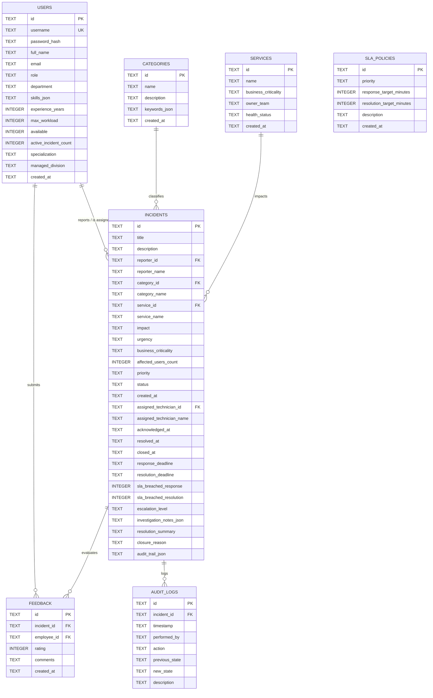

# I-ITSM Entity-Relationship (ER) Diagram

```mermaid
erDiagram
    USERS ||--o{ INCIDENTS : "reports / is assigned"
    USERS ||--o{ FEEDBACK : "submits"
    CATEGORIES ||--o{ INCIDENTS : "classifies"
    SERVICES ||--o{ INCIDENTS : "impacts"
    INCIDENTS ||--o{ FEEDBACK : "evaluates"
    INCIDENTS ||--o{ AUDIT_LOGS : "logs"

    USERS {
        TEXT id PK
        TEXT username UK
        TEXT password_hash
        TEXT full_name
        TEXT email
        TEXT role
        TEXT department
        TEXT skills_json
        INTEGER experience_years
        INTEGER max_workload
        INTEGER available
        INTEGER active_incident_count
        TEXT specialization
        TEXT managed_division
        TEXT created_at
    }

    SERVICES {
        TEXT id PK
        TEXT name
        TEXT business_criticality
        TEXT owner_team
        TEXT health_status
        TEXT created_at
    }

    CATEGORIES {
        TEXT id PK
        TEXT name
        TEXT description
        TEXT keywords_json
        TEXT created_at
    }

    SLA_POLICIES {
        TEXT id PK
        TEXT priority
        INTEGER response_target_minutes
        INTEGER resolution_target_minutes
        TEXT description
        TEXT created_at
    }

    INCIDENTS {
        TEXT id PK
        TEXT title
        TEXT description
        TEXT reporter_id FK
        TEXT reporter_name
        TEXT category_id FK
        TEXT category_name
        TEXT service_id FK
        TEXT service_name
        TEXT impact
        TEXT urgency
        TEXT business_criticality
        INTEGER affected_users_count
        TEXT priority
        TEXT status
        TEXT created_at
        TEXT assigned_technician_id FK
        TEXT assigned_technician_name
        TEXT acknowledged_at
        TEXT resolved_at
        TEXT closed_at
        TEXT response_deadline
        TEXT resolution_deadline
        INTEGER sla_breached_response
        INTEGER sla_breached_resolution
        TEXT escalation_level
        TEXT investigation_notes_json
        TEXT resolution_summary
        TEXT closure_reason
        TEXT audit_trail_json
    }

    FEEDBACK {
        TEXT id PK
        TEXT incident_id FK
        TEXT employee_id FK
        INTEGER rating
        TEXT comments
        TEXT created_at
    }

    AUDIT_LOGS {
        TEXT id PK
        TEXT incident_id FK
        TEXT timestamp
        TEXT performed_by
        TEXT action
        TEXT previous_state
        TEXT new_state
        TEXT description
    }
```
